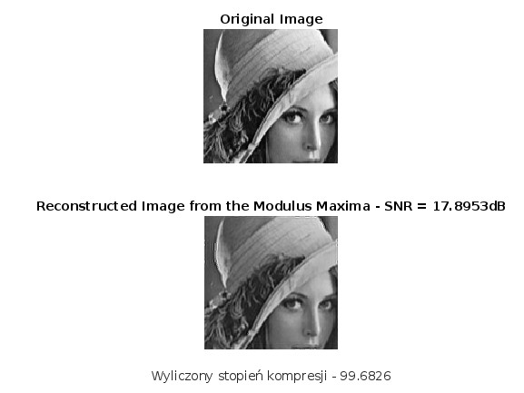
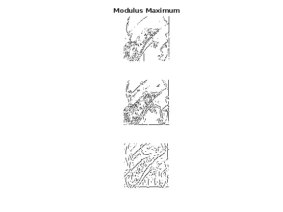

# AFA Projekt Rekonstrukcji Obrazu
**Wojciech Czerski s20458 i Kinga Kalbarczyk s20474**

Ten projekt ma na celu przeprowadzenie rekonstrukcji obrazu przy użyciu algorytmu `recon_mm2` w MATLAB. Algorytm wykorzystuje narzędzia Wavelet Toolbox do przetwarzania obrazów.

## Przegląd projektu

Celem tego projektu jest rekonstrukcja obrazu przy użyciu algorytmu `recon_mm2`, który wykorzystuje transformację falkową atrous. Algorytm przyjmuje obraz wejściowy i wykonuje analizę wieloskalową, używając transformacji falkowej do dekompozycji obrazu na różne pasma częstotliwościowe. Następnie stosuje zmodyfikowaną wersję transformacji falkowej atrous, aby wzmocnić konkretne detale i cechy obrazu. Ostatecznie algorytm odtwarza obraz przy użyciu odwrotnej transformacji falkowej.

## Spis treści
1. [Wymagania](#wymagania)
	- [Instrukcja](#instrukcja)
	- [Przykład](#przykład)
2. [Wyniki](#wyniki)
	- [Stopień kompresji](#stopień-kompresji)
	- [Stosunek sygnału do szumu](#stosunek-sygnału-do-szumu)
	- [Podsumowanie](#podsumowanie)
3. [Dokumentacja](#dokumentacja)

## Wymagania
Aby uruchomić ten projekt, będziesz potrzebować:

- MATLAB z dostępem do narzędzi Wavelet Toolbox.
- Obraz wejściowy do rekonstrukcji.

### Instrukcja

1. Otwórz MATLAB i upewnij się, że masz dostęp do narzędzi Wavelet Toolbox.

2. Ustaw katalog roboczy na lokalizację plików projektu.

3. Wczytaj:
	- obraz wejściowy do MATLAB. Możesz użyć funkcji `image_name = 'twoja_nazwa_obrazka.png';`, aby wczytać obraz z pliku.
	- ustal liczbę poziomów za pomocą `levels = twoja_liczba`
	- ustal progi za pomocą `threshold = [liczba1, liczba2, ...]`

	Pamiętaj, aby **liczba progów** miała taką samą długość co **liczba poziomów !**
	`levels = threshold.length`

4. Uruchom skrypt `recon_mm2` w MATLAB. Skrypt ten implementuje algorytm rekonstrukcji obrazu przy użyciu funkcji "dyadup" z narzędzi Wavelet Toolbox.

5. Jeśli napotkasz błąd związanym z narzędziami Wavelet Toolbox, upewnij się, że masz wymagane licencje lub spróbuj alternatywnych technik rekonstrukcji obrazu dostępnych w MATLAB.

6. Przejrzyj wyjściowy obraz. Odtworzony obraz zostanie wyświetlony w oknie figury MATLAB.

7. Eksperymentuj z różnymi parametrami (`levels`, `threshold`) i obrazami wejściowymi (`image_name`), aby uzyskać pożądane rezultaty.

### Przykład
Poniżej znajduje się przykładowe użycie projektu.

W oknie poleceń MATLAB wprowadź następujące polecenie:
```matlab
image_name = 'Lena.bmp';
levels = 3;
threshold = [25, 25, 10];

recon_mm2(levels, threshold, image_name);
```

## Wyniki




**Reconstructed Image from the Modulus Maxima - SNR =** `17.8953 dB`

**Wyliczony stopień kompresji =** `99.6826`

### Stopień kompresji
Wyliczony stopień kompresji wynosi 99.6826. Oznacza to, że model osiągnął wysoki stopień kompresji, co jest pozytywnym wynikiem. Im wyższy stopień kompresji, tym mniejsze zajętość danych, co może być korzystne w przypadku przechowywania i przesyłania obrazów.

### Stosunek sygnału do szumu
SNR wynosi 17.8953 dB. SNR jest miarą jakości rekonstrukcji obrazu i informuje o stosunku sygnału obrazu do poziomu szumu. Wyższy SNR oznacza lepszą jakość rekonstrukcji, gdzie większa część informacji obrazowej została zachowana. Wartość 17.8953 dB wskazuje na przyzwoitą jakość rekonstrukcji, choć może być jeszcze pole do poprawy.

### Podsumowanie
Ten model osiągnął wysoki stopień kompresji, co jest korzystne z punktu widzenia efektywnego wykorzystania miejsca, ale jakość rekonstrukcji może być dalej doskonalona w celu zwiększenia SNR i zachowania większej liczby detali obrazu.